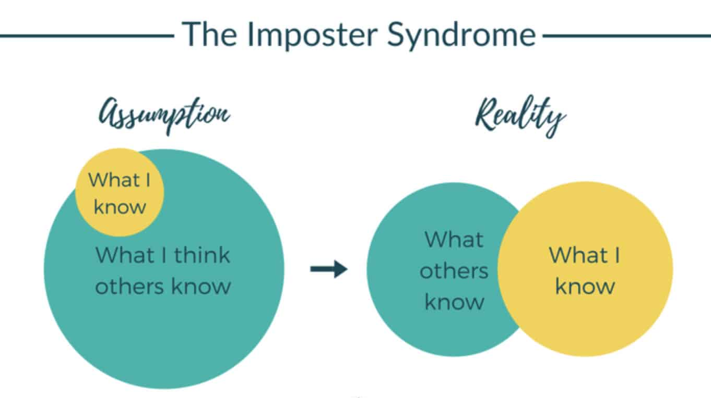
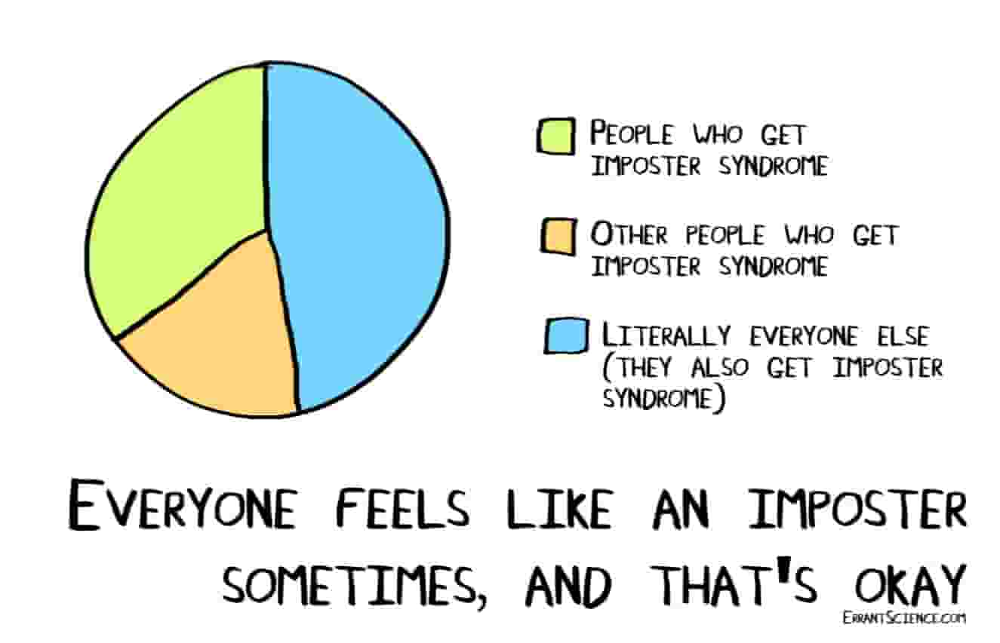

Have you ever have a feeling that someone around you is better than you in every aspect. How often do we compare ourselves with others and feel sick about it? That's what [Imposter Syndrome](https://en.wikipedia.org/wiki/Impostor_syndrome) is for you.

Imposter Syndrome makes us feel like I would never be able to achieve what he/she can do or have accomplished. It eventually leads to depression and a feeling of anxiety. 

> The beauty of the impostor syndrome is you vacillate between extreme egomania and a complete feeling of: “ I'm a fraud! Oh God, they’re onto me! I'm a fraud! '' So you just try to ride the egomania when it comes and enjoy it, and then slide through the idea of fraud.  
-**Tina Frey**

One of the biggest problems with Imposter Syndrome ,i.e, most of the people don't tell their difficulties aloud to others. It creates a barrier in the road of success and we can't truly adore the success we have achieved.

# My Story
Being a " programmer " we have a huge chunk of things to learn, i.e, new programing language, different technologies and BLAH! BLAH! BLAHHH!!!...

When I see others in any field, also in programming, I always look up to the experts in a specific field and anticipate that they know soooo much of stuff and will I be able to ever master so much of things.

Also when I look at the students of my age who have worked hard to reach their goals, I often assume myself as a failure and it creates a Imposter Syndrome which sometimes demotivate me and a lot of motivation videos are required to recover it which is not a good sign.

I always try my best to make Imposter Syndrome, not as an obstacle but something which pushes me to work more and make things better.

# How to  Overcome it?

- Share your imposter syndrome stories to others.

- Set reasonable and timely goals.

- Create a support group which is equal and supports you in various ways.

- Believe the praise.

- Don't let that doubt control your actions.

- Respond to challenges

# Conclusion

Imposter Syndrome is something that will never stop how much you try to overcome it, only it's noise will reduce. More successful you are, the more likely you are to be impacted by Imposter Syndrome — and that success can be defined in many ways.

> Our greatest glory is not in never falling, but in rising every time we fall. **-CONFUCIUS**

In the end, I just want to say never let Imposter Syndrome control and stop you from achieving your goals.

