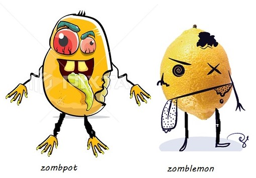

Earth, place where varmint humans live who think in whole universe life exist only on earth. Beyond their imagination level there was planet in universe namely **ZAMBONI** where clever zombies exist who knew about earth and HUMANS. Most of the time they travel from Zamboni to earth through a black door which they called it as **ZODOR**.

They travel because of zorathon , the marathon in which zombies has to travel to earth and taste different types of blood and bring a sample to Zamboni and who so ever comes with more number of sample gets a chance to become 1 month ruler of Zamboni , or they can collect much amount of wealth from actual ruler. In the Zamboni all zombies think about themselves and about power and besides them there lived two friends “**ZOMBLEMON**” and “**ZOMBPOT**”.

They were “best friends”, commonly known as [Hoapili](https://hawaiian-words.com/dictionary/hawaiian-english/hoapili/). Zomblemon was champion of zorathon. whereas zombpot always comes last and always gets demotivated. His friend always tries to cheer him up and motivate him to try next year. 

Zomblemon was famous, wealthy and altruistic zombie but people always try to degrade his personality by saying harsh words about him. Zombies usually hate him because of the fame he achieved by winning zorathon for consecutively 4 yrs. Zomblemon was rare, his leg had a birth mark indicating his heart. His mark was the second reason of the fame. 

While, zombpot was poor. One day Zombto, zombpot’s little brother met with an accident and his leg got permanently damaged. Doctors insisted for leg transplant because he had a life ahead. Since zombpot was poor he can’t afford operation fees so he asked Zomblemon for help.

After narrating whole story of what happened to Zombto,

>Zombpot: *Friend please help me I need money. I will become your slave for rest of my life.*

>Zomblemon:  *Why should I? you are so poor and you are a big LOSER, you can’t even pay back my zocoin(currency), you don’t even have job and even you can’t win zorathon and I have lots of useless slave, I don’t want more.
Here, a tip of 2 zocoin for zobto(auto) to go back to your ugly house n cry!!*   

>Zombpot: *You are my only friend to whom I can trust and ask for help and you think such things about me. All other zombies were right you are scoundrel. Our friendship is over. I don’t want to see your face again.*

Zombpot left zomblemon’s mansion.

>Zomblemon’s manager (Zendox): *why you didn’t help your friend?*

>Zomblemon: *If I had helped him then he’ll be under me for whole life and can never come up.*

>Zendox: *what now, if he can’t arrange money, he won’t be able to pay operation fees and his brother’s life might ruin.*

>Zomblemon: *I know he can’t and so can you do me a favour?*

>Zendox: *for sure, what is it?*

Zomblemon asked him to fire up zombpot’s mind and make him ready for zorathon. Zendox did the same. On the day of zorathon everyone was ready including zombpot with fire in his eyes. Zorathon started and zombpot won zorathon everyone was surprised including zombpot but he enjoyed the fame and took the wealth and paid the operation fees. His brother got a leg back. After zorathon no one had saw zomblemon’s face. After few years zombpot and his brother met Zendox and thank him and asked him about Zomblemon. Zendox replied with a smile, “he is with you” and he left. Zomblemon didn’t got what Zendox was trying to say after reaching home he noticed the birth mark on Zombto’s leg. The same birth mark which he saw on zomblemon’s leg, and cried for not understanding his friend. Zombto was shocked seeing his brother crying for a small mark he asked his brother what happened?

>Zombpot replied: *In your whole life always remember one thing:*

**“_Friendship is all about understanding and not about agreement._”**

